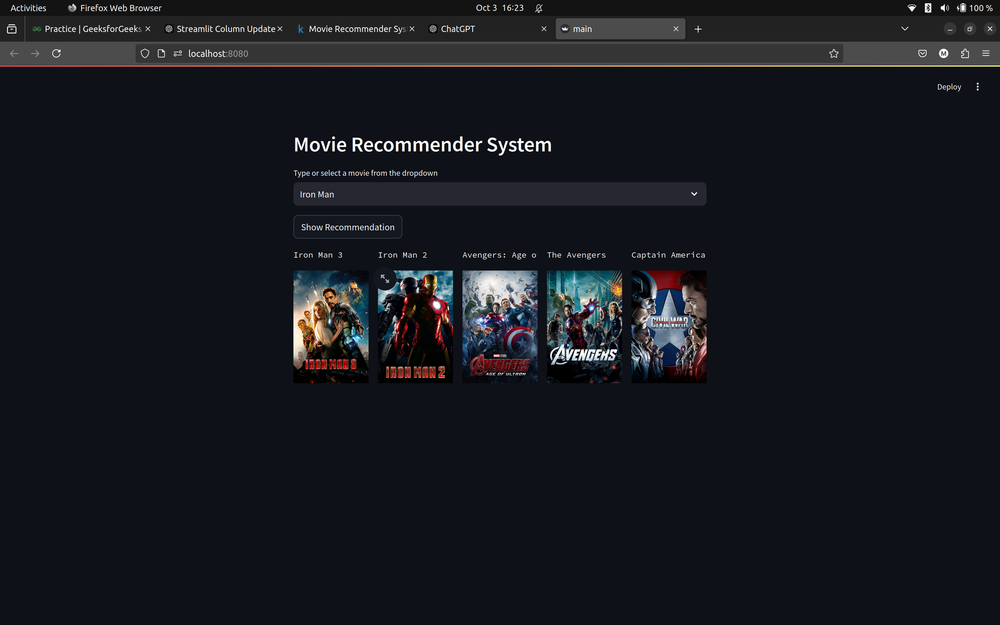

# Movie Recommender System

This repository contains a movie recommender system built using the **TMDB5000** dataset available on Kaggle. The model POC and embedding extraction is available [here](https://www.kaggle.com/code/madhavarora03/movie-recommender-system). The system extracts key movie features, processes them into vector embeddings using the **Bag of Words** technique, and recommends movies based on **Cosine Similarity**. The app is built using **Streamlit** to allow users to search for a movie and receive recommendations.



## Table of Contents

1. [Dataset Overview](#dataset-overview)
2. [Feature Engineering](#feature-engineering)
3. [Modeling](#modeling)
4. [Installation](#installation)

---

## Dataset Overview

The system uses the TMDB 5000 dataset, which consists of two CSV files:

- **movies.csv**: Contains metadata about movies such as titles, genres, overviews, etc.
- **credits.csv**: Contains information about the cast and crew for each movie.

### Steps for Preprocessing

1. **Null Value Removal**: We first removed null values from the `movies.csv` and `credits.csv` files.
2. **Feature Creation**: A new feature, `tags`, was created by combining the following attributes:
   - `overview`
   - `genres`
   - `keywords`
   - `cast`
   - `crew`

---

## Feature Engineering

### Bag of Words Technique

After combining the features, we applied the **Bag of Words (BoW)** technique to convert the textual data into vector embeddings. The following steps were taken:

- **Stemming**: The text was reduced to its base form using the **NLTK** library's `PorterStemmer` to eliminate variations of words.
- **Top 10,000 Words**: A vocabulary was created by considering the top 10,000 most frequent words across all tags.


---

## Modeling

### Cosine Similarity

We used **Cosine Similarity** to measure the similarity between movie vectors. Cosine similarity is defined as:

$$
\text{Cosine Similarity} = \frac{\mathbf{A} \cdot \mathbf{B}}{\|\mathbf{A}\| \|\mathbf{B}\|}
$$

Where:

- $\mathbf{A}$ and $\mathbf{B}$ are the vector embeddings of two movies.
- The dot ($ \cdot $) represents the dot product of the vectors.
- $ \|\mathbf{A}\| $ and $ \|\mathbf{B}\| $ are the magnitudes of the vectors.

This similarity metric ranges from -1 (completely dissimilar) to 1 (perfectly similar). For this project, we used positive similarity values.

---

## Installation

To run the app locally, follow these steps:

1. Clone the repository:
   ```bash
   git clone https://github.com/yourusername/movie-recommender-system.git
   ```
2. Navigate to the project directory:
   ```bash
   cd movie-recommender-system
   ```
3. Install the required dependencies:
   ```bash
   pip install -r requirements.txt
   ```
4. Run the Streamlit app:
   ```bash
   streamlit run app.py
   ```
